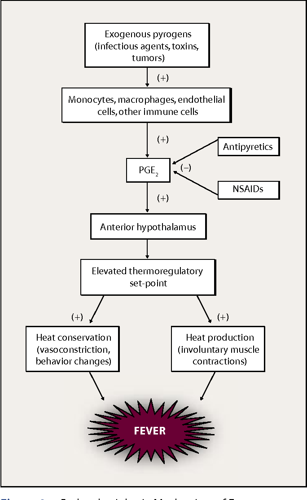

alias:: hyperthermia,  pyrexia
definition:: A body temperature of 38 ºC (100.4 ºF) or higher is considered a fever

- ## Associations
  collapsed:: true
	- Associated Signs and Symptoms
		- | **Symptom** | **Sensitivity (%)** | **Specificity (%)** |
		  |--|--|--|
		  | **Headache** | 60 - 70% | 50 - 60% |
		  | **Chills / Shivering** | 40 - 60% | 60 - 70% |
		  | **Fatigue** | 50 - 70% | 40 - 50% |
		  | **Nausea** | 20 - 40% | 60 - 70% |
		  | **Vomiting** | 15 - 30% | 70 - 80% |
		  | **Sweating** | 30 - 50% | 50 - 60% |
		  | **Loss of Appetite** | 40 - 60% | 50 - 60% |
		  | **Dizziness** | 10 - 20% | 50 - 60% |
		  | **Dehydration** | 20 - 40% | 60 - 70% |
	- Associated conditions
		- | **Condition** | **Sensitivity (%)**| **Specificity (%)**  |**Association**|
		  |--|--|--|--|
		  | **Infections (Overall)** | 90 - 95% | 85 - 90% |85-90%|
		  | **Viral Infections** | 60 - 70% | 60 - 70% |80-90%|
		  | **Bacterial Infections** | 20 - 30% | 70 - 80% |75-85%|
		  | **Fungal and Parasitic Infections** | 5 - 10% | 40 - 60% |80-90%|
		  | **Inflammatory Conditions** | 10 - 20% | 20 - 40% |90-95%|
		  | **Autoimmune Diseases (e.g., Lupus)** | 5 - 10% | 20 - 30% |95%|
		  | **Inflammatory Bowel Disease** | 2 - 5% | 10 - 20% |90-95%|
		  | **Heatstroke** | 5 - 10% | 100% |100%|
		  | **Drug Reactions / Fever** | 1 - 3% | 5 - 10% |95%|
		  | **Cancer (e.g., Hematologic)** | 1 - 2% | 10 - 20% |90-95%|
		  | **Endocrine Disorders (e.g., Hyperthyroidism)** | <1% | 5 - 10% |90-95%|
		  | **Post-vaccination Fever** | <1% | 1 - 5% |95-98%|
- > Note : A fever is not an illness by itself, but, rather, a sign that something is not right within the body.
- ## Classification
	- |Type of Fever|Temperature|
	  |--|--|
	  |Low-grade Fever|100.4 ºF - 102.2 ºF (38 ºC - 39 ºC)|
	  |Moderate Fever|102.2 ºF - 104 ºF (39 ºC - 40 ºC)|
	  |High Fever|>104 ºF (>40 ºC)|
	- |Type of Fever|Duration|
	  |--|--|
	  |Acute Fever|<7 days|
	  |Subacute Fever|7-14 days|
	  |Chronic Fever|>14 days|
	- |Type of Fever|Pattern|
	  |--|--|
	  |Intermittent Fever|Fever episodes alternate with periods of normal temperature (e.g., [[Malaria]]).|
	  |Remittent Fever|Fever fluctuates but does not return to normal (e.g., [[Typhoid]] )|
	  |Continuous Fever|Fever remains consistently elevated (e.g., [[Pneumonia]] )|
	  |Relapsing Fever|Episodes of fever occur intermittently with periods of normal temperature (e.g., [[Lyme Disease]] )|
	- TODO Replasing Fever example
	  :LOGBOOK:
	  CLOCK: [2024-10-09 Wed 08:31:20]--[2024-10-09 Wed 08:31:21] =>  00:00:01
	  CLOCK: [2024-10-09 Wed 08:31:21]--[2024-10-09 Wed 08:31:21] =>  00:00:00
	  CLOCK: [2024-10-09 Wed 08:31:25]--[2024-10-09 Wed 08:31:25] =>  00:00:00
	  :END:
	-
- ## Pathophysiology
	- {:height 591, :width 301}
- ## Symptomatic Management
  collapsed:: true
	- Pharmacolgical
		- Antipyretics
			- [[Paracetamol]]
			- [[NSAIDS]]
		- [[Corticosteroids]]
		- [[Antibiotics]]
	- Non Pharmacological
		- Hydration
		- Physical Cooling Methods
			- Luke-warm sponge baths
				- avoid cold baths, as it can cause shivering and rise in temperature (do not submerge in ice bath even if sever rise of temperature, this is not a move, and it can be counterintuitive)
				- avoid alcohol application all over the body, this can lead to alcohol poisoning
				- monitor for shivering
			- Cooling baths, sponge (forehead, neck, armpits, groin)
		- Comfort Measures
			- Rest
			- Light Clothing
		- Ventilation
		- Diet : easily digestible food, focus on nutrition & hydration
- ## Complications
	- Dehydration
	- Febrile seizures in young children
	- Organ Dysfucntion
	- Rhabdomyolysis
	- Hyperthermia